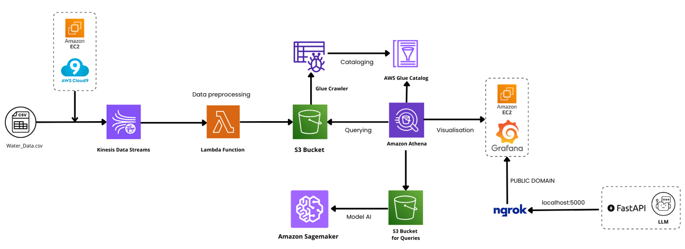

# 📊 Water Quality Index Prediction and Population Density Tracking System

## Table of Contents

- [📌 Project Overview](#-project-overview)
- [📁 Directory Structure](#-directory-structure)
- [🏗️ Project Architecture](#%EF%B8%8F-project-architecture)
- [📜 Data](#-data)
  - [Data Description](#data-description)
  - [Data Preparation](#data-preparation)
- [🤖 Model](#-model)
- [🤖 LLM](#-llm)
- [☁️ AWS Set Up](#-aws-set-up)
  - [🧱 Architecture Components](#architecture-components)
  - [### ⚙️ Set Up Instructions](#set-up-instructions)
- [📈 Resultat](#-resultat)
- [🔧 Usage](#-usage)
- [🔮 Future Considerations](#-future-considerations)
- [🤝 Contributing](#-contributing)
- [👨‍💻 Project By](#project-by)

## 📌 Project Overview  

### 📚 Background:

This project, developed by Edam Hamza and Farah Elloumi as part of their academic work at the Higher School of Communication of Tunis (SUP'COM), focuses on analyzing and forecasting water quality parameters. Additionally, it utilizes these results to predict population movements during events. The solution leverages various AWS services for data ingestion, processing, storage, and visualization.

### 🌟 The project must include:

- **✅ Real-Time Data Processing**:
  - Utilizes AWS Kinesis Data Streams for ingesting water quality and population data in real-time.
  - Ensures seamless data flow and preprocessing through AWS Lambda to handle rapid updates efficiently.

- **🔍 Advanced Data Analysis and Insights**:
  - Integrates Amazon Athena for querying large datasets and providing actionable insights.
  - Employs Amazon SageMaker to develop a forecasting model for predicting water quality and population density patterns during events.

- **📊 Dynamic Visualization**:
  - Builds an interactive and real-time Grafana dashboard hosted on EC2, enabling users to monitor key metrics and trends visually.
  - Displays predictions and insights in an intuitive manner to assist decision-making.

- **🤖 AI-Powered Query Interface**:
  - Incorporates a Large Language Model (LLM) to allow natural language queries on water quality and population data.
  - Ensures secure and remote access to the querying API using Ngrok.

- **🛠️ Scalable and Extensible Architecture**:
  - Employs a modular design with clear separation between data ingestion, preprocessing, forecasting, and visualization components.
  - Facilitates the easy addition of new models, data sources, and features for future upgrades.

## 📁 Directory Structure

```plaintext
project/
│
├── AWS Sagemaker
│   ├── prophet_forecast_s3.ipynb       # Forecast model using Prophet and S3
│                   
├── Cloud9/
│   ├── data_producer.py                # Streams water data to Kinesis
│   ├── water_data_final.csv            # Final processed dataset
│      
├── Data Preparation/
│   ├── raw_data/
│   ├──   ├── 2017_lake_data.csv        # Water quality data for the year 2017
│   ├──   ├── 2018_lake_data.csv        # Water quality data for the year 2018
│   ├──   ├── 2019_lake_data.csv        # Water quality data for the year 2019
│   ├──   ├── 2020_lake_data.csv        # Water quality data for the year 2020
│   ├──   ├── 2021_lake_data.csv        # Water quality data for the year 2021
│   ├──   ├── 2022_lake_data.csv        # Water quality data for the year 2022
│   ├── data-prep.ipynb                 # Data cleaning notebook
│   ├── filtered_data.csv               # Data contains STN Code,lat,lon
│   ├── location_coords_geopy.txt       # Water location coordinates
│   ├── water_data_final.csv            # Final processed dataset
│   ├── wqi-prediction.ipynb            # WQI prediction notebook               
│
├── Grafana EC2/
│   ├── dashboard.json                  # Grafana dashboard config
│   ├── initialize.bash                 # Script to set up Grafana
│
├── Lambda/
│   ├── data_transformation.py          # Lambda for data preprocessing
│
├── LLM_ngrok_FastAPI/                  
│   ├── llm.py                          # FastAPI with LLM and Ngrok
│                          
└── README.md                           # Project documentation 
```

## 🏗️ Project Architecture

### Global Architecture


🔍 **How it Works:**
1. **Real-Time Data Pipeline**: Collects water data using Kinesis Data Streams and preprocesses it through AWS Lambda before storing it in Amazon S3.
2. **Data Cataloging and Querying**: AWS Glue catalogs the data for structured querying via Amazon Athena, enabling efficient data analysis.
3. **AI Model Integration**: Amazon SageMaker forecasts water quality metrics, and results are stored in S3 for further querying.
4. **Visualization and Accessibility**: A Grafana dashboard hosted on EC2 visualizes the data, while Ngrok securely exposes a FastAPI interface with an integrated LLM for natural language querying.

## 📜 Data
### Data Description
The dataset used in this project spans 6 years (2017–2022), with water quality data collected from numerous monitoring stations (STN codes) across Indian Lakes. For each year, the dataset includes a rich set of features:
- **Station Details**:  
  - STN Code  
  - Monitoring Location Name  
  - Type of Water Body  
  - State Name  

- **Environmental Parameters**:  
  - **Temperature**: Min/Max Temperature (°C)  
  - **Dissolved Oxygen**: Min/Max Levels (mg/L)  
  - **pH**: Min/Max pH Levels  
  - **Conductivity**: Min/Max Conductivity (µS/cm)  
  - **Biochemical Oxygen Demand (BOD)**: Min/Max Levels (mg/L)  
  - **Nitrate and Nitrite Nitrogen**: Min/Max Levels (mg/L)  
  - **Fecal and Total Coliform**
This dataset provides comprehensive insights into water quality trends, supporting robust analysis and predictions. Each year's data encompasses multiple monitoring stations to ensure accurate and diverse coverage.

**Dataset Source**: [NWMP Water Quality Data for Indian Lakes](https://www.kaggle.com/datasets/akkshaysr/nwmp-water-quality-data-for-indian-lakes)

### Data Preparation
In this project, we prepared a comprehensive water quality dataset by focusing on **Indian Lakes** across multiple years. The objective was to consolidate data from different sources and perform necessary data cleaning, transformation, and integration to ensure a robust dataset for analysis and visualization.

#### Key Steps in Data Preparation

1. **Concatenate Data Across Years**  
   Data from multiple years (**2017-2022**) was combined into a single unified DataFrame. A new **"Year"** column was added to indicate the corresponding year for each observation.

2. **Filtering for Lakes Only**  
   We filtered the dataset to retain only the Type Water Body labeled as **"LAKE"**. This ensures our analysis focuses exclusively on lake water quality.

3. **Data Cleaning**  
   Numerical columns such as **temperature, BOD, pH, and conductivity** were converted to numeric types for analysis.

4. **Calculating the Water Quality Index (WQI)**  
   For each sample, we calculated the **Water Quality Index (WQI)** by aggregating the minimum and maximum values of relevant parameters like **Dissolved Oxygen, pH, Conductivity, and Coliform counts**.

5. **Geographical Integration**  
   Using the **geopy library**, we obtained the **latitude and longitude** information for each **STN Code**. This geographic data was then integrated into the dataset, ensuring each station's location is accurately represented across all years.

6. **Final Dataset - `water_final_data`**  
   The final dataset includes:
   - All **STN Codes** across each year  
   - Geographical coordinates (**latitude and longitude**) for monitoring locations  
   - Calculated **WQI values** for evaluating water quality trends

#### Project Files

- **Data Integration, Cleaning and WQI Calculation**: Merges and consolidates lake data across all years and Computes Water Quality Index based on relevant water quality parameters 
- **Geographical Integration**: Adds latitude and longitude using the geopy library  
- **`water_final_data`**: Final dataset containing STN Codes, years, WQI, and location coordinates  

#### How to Use the Dataset

- Perform **spatio-temporal analyses** to observe trends in water quality across different monitoring stations.
- Visualize **geographic distributions of water quality** using mapping libraries like Geopandas or folium.
- Conduct **yearly comparisons** to evaluate seasonal or annual changes in water parameters.

#### Installation & Dependencies

Ensure you have the following Python packages installed:

- `pandas`
- `numpy`
- `geopy`

Install missing packages using:

```
pip install pandas numpy geopy
```


## 🤖 Model

### Water Quality Forecasting with Prophet Model

This project leverages the **Prophet model** to forecast water quality parameters for monitoring stations over the years **2023 and 2024**. Using the `forecast_parameters_sagemaker` function, we predict key features such as:

- **Dissolved Oxygen**
- **pH**
- **Conductivity**
- **BOD (Biochemical Oxygen Demand)**
- **Nitrate N + Nitrite N**
- **Fecal Coliform**
- **Total Coliform**
- **Water Quality Index (WQI)**  

The goal is to provide actionable insights into the trends and patterns in lake water quality.


### Key Components of the Forecast Model

#### 1. Data Preparation for Forecasting

- The data includes water quality observations gathered from different monitoring stations.
- The `Year` column is transformed into a datetime object to work with Prophet's time-based forecasting.
- For each monitoring station, we prepare data for each feature individually and rename the columns to align with Prophet's expected input (`ds` for date and `y` for value).


#### 2. Using the Prophet Model

- For each **water quality parameter**, we train the **Prophet model** independently.

- **Forecast Generation**:
  - For each monitoring station, we generate forecasts up to the desired future years **(2023, 2024)**.
  - The function outputs predictions for each parameter and stores them in the `final_results` dictionary.

#### 3. Uploading Forecast Data to S3
- Each station's forecast data is **converted to JSON**.
- The JSON files are organized in an **S3 hierarchy** following the pattern:
  - `year` / `stn_code` `/forecast_{year}_{stn_code}.json`

## 🤖 LLM
### GPT-2 Integration with Flask API
This project integrates the GPT-2 language model to generate comprehensive summaries for water quality assessments based on environmental parameters. The API processes inputs such as dissolved oxygen levels, pH, conductivity, and Water Quality Index (WQI) to provide insightful narratives for informed decision-making.

#### Key Features
- **Dynamic Summaries**: Generates human-readable summaries for water quality.
- **Custom WQI Classifications**: Categorizes water quality based on WQI values.
- **Flask API**: Enables seamless interaction with the model through HTTP requests.

#### Project Setup

**Prerequisites**
- Python 3.7 or higher.
- Install dependencies:
  ```bash
  pip install flask transformers
  ```
- Ensure you have internet access to download the pre-trained GPT-2 model: `openai-community/gpt2`.

**Running the Application**
1. Start the Flask server:
   ```bash
   python llm.py
   ```
2. Access the API at `http://localhost:5000`.

#### API Endpoints

`GET /lake_summary`
Generates a detailed summary of the lake's water quality.

#### Response:
Returns a JSON object with a detailed summary and recommendations.

#### Technical Highlights
- **Model**: Uses `openai-community/gpt2` for text generation.
- **Processing**: Classifies WQI into categories: `Excellent`, `Good`, `Poor`, `Very Poor`, and `Unsuitable for Drinking`.
- **API Design**: Flask handles requests and responses, ensuring modularity and ease of use.

## ☁️ AWS Set Up

In this phase, we set up a comprehensive cloud architecture on AWS for **data processing, analysis, and real-time visualization** of water quality data. The goal is to collect, preprocess, forecast, and visualize data seamlessly while ensuring scalability and reliability across multiple AWS services.


### 🧱 Architecture Components

#### 1. **Data Source**
- **Water_Data.csv**
  - Contains information about water quality collected from multiple stations.
  - Hosted on **Cloud9**.

#### 2. Streaming Data
- **Amazon Kinesis Data Streams**
  - Continuously streams data from CSV files into Kinesis for real-time processing.

#### 3. Data Preprocessing
- **AWS Lambda Functions**
  - Automatically process and clean incoming data.
  - Transfer data to **Amazon S3** for storage and querying.
 
  

#### 4. Storage
- **S3 Buckets**
 - Stores raw and processed data in a structured hierarchy: `year=year/stn_code=stn_code/file.json`.

#### 5. Data Analysis
- **Amazon Athena**
  - Perform **SQL queries directly on S3 files** to analyze water quality metrics.
  - Generate consolidated results for querying and forecasting.

#### 6. Forecasting Model
- **Amazon SageMaker**
  - Use the **Prophet model** to forecast water parameters for 2023 and 2024.
  - Train and deploy forecasting models for each water station.

#### 7. Visualization
- **Amazon EC2 + Grafana**
  - Visualize water quality data using **Grafana dashboards** hosted on EC2 instances.
  - Interactive dashboards present trends and forecasts.

- **Ngrok + FastAPI**
  - Expose **FastAPI** endpoints to make your API publicly accessible.
  - Provides real-time integration for data visualization and forecasting.

### ⚙️ Setup Instructions

Follow these steps to set up your environment on AWS:

1. **Configure AWS CLI**
Ensure you have installed and configured the AWS CLI on your system.

2. **Set Your AWS Credentials**
You need the following AWS tokens to connect to AWS services:

- **`aws_access_key_id`**
- **`aws_secret_access_key`**
- **`aws_session_token`**

These tokens are available in your AWS console under:

- **AWS Management Console** → **AWS Details** section when you sign in to your AWS interface.

You can set these tokens in your script

#### Grafana
We utilize the following data sources for visualization:
1. **grafana-athena-datasource**: Connects Grafana to AWS Athena (requires valid AWS credentials).
2. **Infinity datasource**: Fetches `.json` data from the FastAPI service.

To set up Grafana with Docker in the EC2 instance:
```bash
# Start the Grafana container
docker start grafana-container

# Access the container to configure datasources
docker exec -it -u root <container_id> /bin/bash
```

#### Ngrok
Ngrok is used to expose the local FastAPI service to the internet for external access.
```bash
# Start Ngrok and bind it to the local FastAPI service
ngrok http http://localhost:5000
```

## 📈 Resultat
- **🗺️ Interactive Map:**  
  Displays WQI values across different regions with color-coded visualization for quick interpretation.

- **📅 Trend Analysis:**  
  Allows tracking changes in water quality over time for selected locations.

- **📊 Detailed Metrics:**  
  Highlights key water quality parameters:
  - **pH**  
  - **Dissolved Oxygen (DO)**  
  - **Biological Oxygen Demand (BOD)**  
  - **Conductivity**  
  - **Fecal Coliform & Total Coliform**  

- **🤖 Chatbot Descriptive Integration:**

The chatbot embedded in the dashboard can analyze and interpret detailed water quality metrics. It provides accurate insights into trends, parameter changes, and recommendations based on essential metrics.

## 🔧 Usage

### Clone the Repository
```bash
git clone https://github.com/yourusername/AWS-MLOPS-WATER-QUALITY-INDEX-FORECAST-VISUALIZE-GRAFANA-GENAI-GPT2.git
cd AWS-MLOPS-WATER-QUALITY-INDEX-FORECAST-VISUALIZE-GRAFANA-GENAI-GPT2
```

## 🔮 Future Considerations
1. **Enhance Real-Time Forecasting Accuracy:**
   - Leverage advanced machine learning and AI models to improve the precision of predictions.

2. **Integration with Additional AWS Services:**
   - Incorporate services like AWS Glue for better data transformation and AWS SageMaker for more robust machine learning workflows.

3. **Optimize AWS Lambda Functions:**
   - Focus on reducing processing latency by fine-tuning function logic and memory allocation.
   - Implement cost-reduction strategies through better architecture and resource allocation.

These improvements aim to provide more accurate insights, faster data processing, and a scalable solution to meet future demands.

## 🤝 Contributing
We welcome contributions to enhance this project! Here's how you can get involved:

1. Fork the repository.
2. Create a new branch for your feature or bug fix.
3. Commit your changes.
4. Open a pull request with a detailed description.

## Project by
<a href="https://github.com/EdamH/AWS-MLOPS-WATER-QUALITY-INDEX-FORECAST-VISUALIZE-GRAFANA-GENAI-GPT2/graphs/contributors">
    
</a>